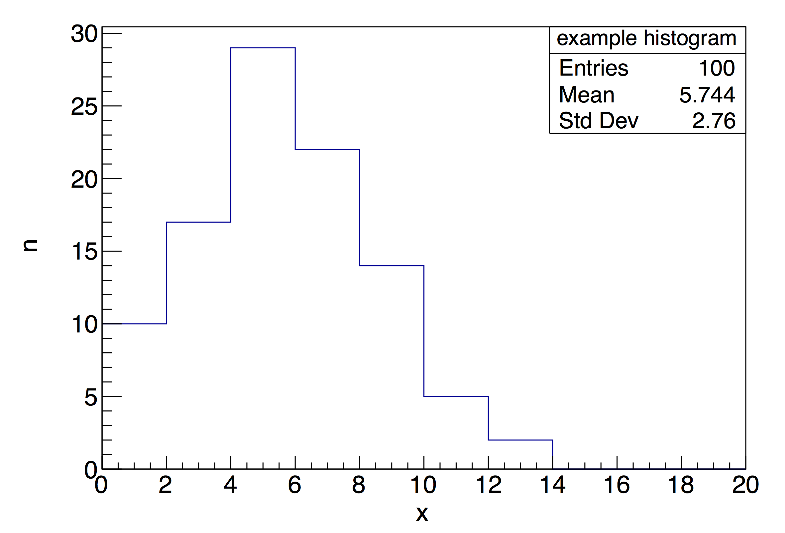
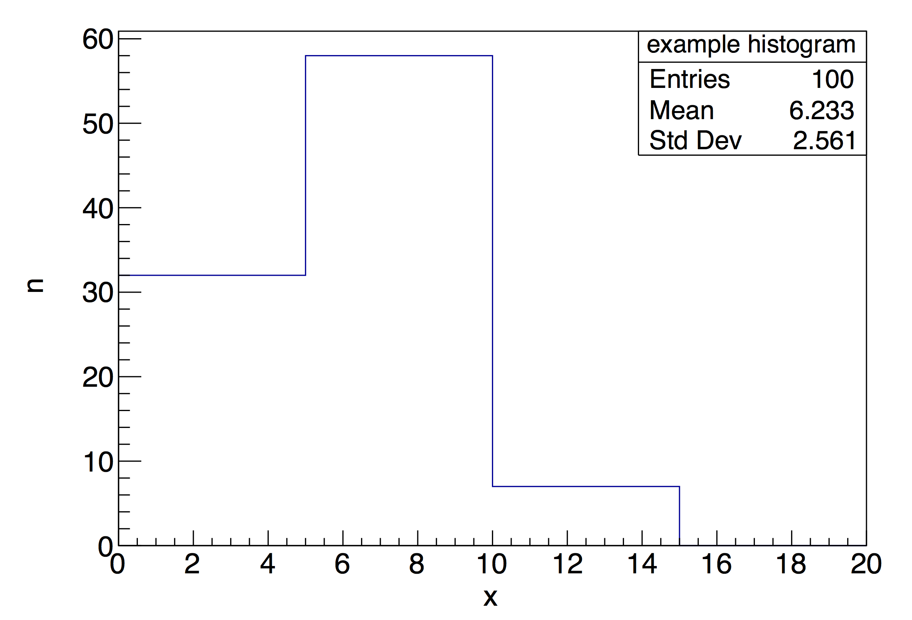
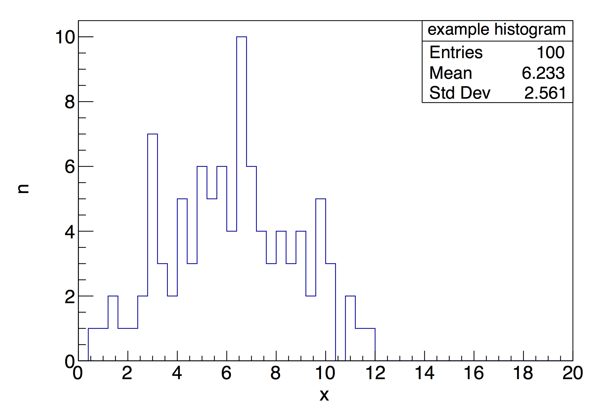
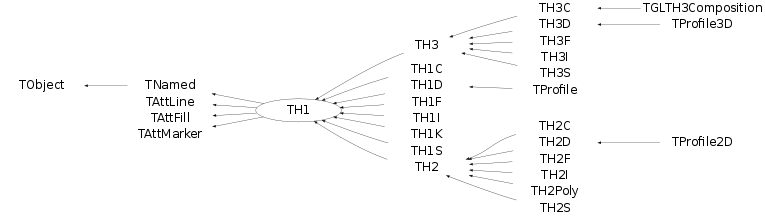
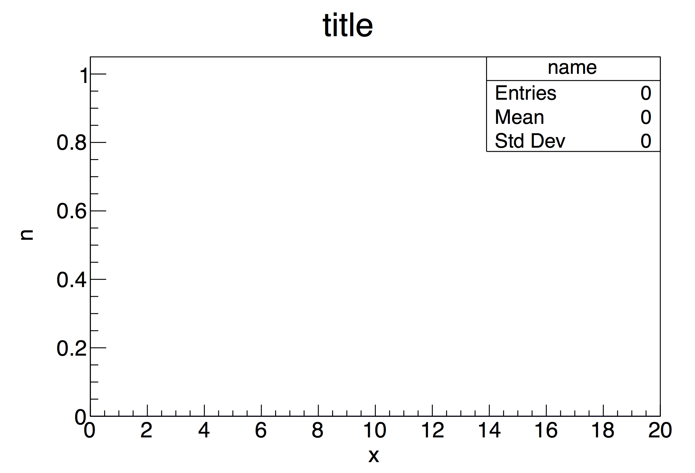
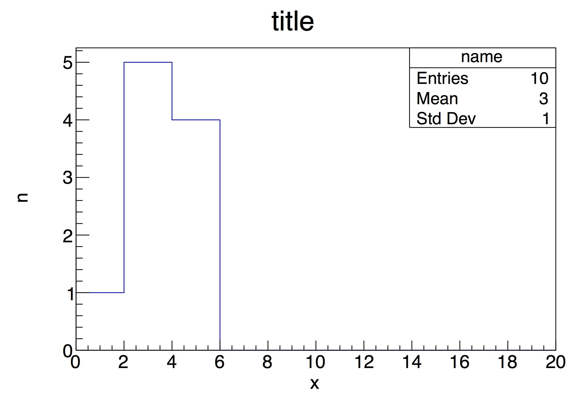

# 3.1 히스토그램 TH1

## 3.1.1 히스토그램 (Histogram) 의 정의


> `그림 3.1` 20개의 빈을 가지고 있는 히스토그램

히스토그램은 어떠한 변수에 대해서 구간별 빈도수를 나타낸 그래프다.
위의 예제는 0부터 20까지의 범위를 10개의 동일한 구간으로 나누고 각 구간에 대해서 변수 x의 빈도수를 그린 히스토그램이다.
여기서 알 수 있듯이 히스토그램의 핵심적인 특성은 다음과 같이 볼 수 있다.

- 변수를 보고자 하는 범위: [0,20); 0 이상 20 미만
- 구간을 나누는 방식: 10개의 구간 동일한 구간
- 분포를 보고자 하는 변수: x

일반적인 경우 히스토그램의 구간을 나눌 때 동일한 간격으로 나누기 때문에 구간의 개수가 중요해진다.
또 표본의 크기가 한정적일 수록 변수 분포의 경향을 보기가 어려워 지는데 이때 각 구간의 넓이가 중요해진다.
가령 앞선 예제의 히스토그램을 그릴 때 10개의 구간이 아닌 4개, 혹은 50개의 구간으로 나누었을 경우 다음과 같은 결과가 나온다.


> `그림 3.2` 4개의 빈을 가지고 있는 히스토그램


> `그림 3.3` 50개의 빈을 가지고 있는 히스토그램

변수 x의 분포가 정규분포(가우시안 분포, Gaussian Distribution)에 가깝다고 가정해보자.
`그림 3.2`의 경우 x의 분포가 약 3개의 구간에 걸쳐서 나타나는데 이를 두고
데이터의 경향에 대하여 설명하기에는 분포가 드러나는 빈 수가 너무 적다.
가령 각 빈의 값에 에러가 없고 분포가 100% 가우시안인 것을 확신할 수 있다면
3 포인트만 있어도 (가우시안의 자유도가 3이므로) 피팅을 통한 분석을 할 수 있다.
하지만 실제 연구를 하다보면 완벽하게 가우시안만이 들어있는 분포는 있을 수 없다는 것을 알 수 있다.

`그림 3.3`의 경우 정규분포가 익숙한 사람들에게는 경향이 보일 수 있다.
하지만 일반적인 사람 입장에서 볼 때 x의 분포가 들쑥날쑥 하기 때문에 수많은
정규분포가 겹쳐있다고 생각 하거나 그저 노이즈라고 생각 하더라도 확실하게 부정할 수 없다.
그 이유는 표본의 크기가 작은 이유도 있겠지만 히스토그램을 그린 사람이 구간의 크기를 적절하게 설정하지 못하였기 때문이기도 하다.
우리가 히스토그램을 그리는 이유는 누구나 직관적으로 그 분포의 경향을 파악 할 수 있도록 하기 위함이다.
표본의 크기가 충분히 크다면 그림을 어떻게 그려도 상관이 없겠지만 현실에서는
표본 추출에 제한사항이 많기 때문에 이를 인지하고 정보전달을 확실히 하도록 노력해야 한다.

### 용어

ROOT 히스토그램을 설명하기 위한 용어를 소개한다.

- `빈`, `Bin`: 히스토그램의 한 구간.
- `Bin Content`: 빈에 들어있는 값. 빈에 들어가는 값이 정수가 아닌 경우도 있기때문에 '빈도수'는 정확하지 않은 설명이다.
- `Statistics Box`: 히스토그램 통계 수치를 나타내는 창. 위 그림들에서 오른, 위쪽에 위치하는 상자를 말한다. 위치와 내용은 변경할 수 있다. 일반적으로 히스토그램의 이름, Entries, Mean, Std Dev 가 표시된다. 줄여서 Stats로 표시한다.
- `엔트리`, `Entry`: 변수 입력. 히스토그램에 입력한 총 입력 개수를 total entries 라고 한다. statistics 상자에 볼 수 있는 Entries가 이에 해당한다.
- `이름`, `Name`: 위 그림에는 볼 수 없지만 히스토그램은 고유한 이름을 가지고 있다. 같은 프로그램 안에서 서로 다른 히스토그램은 이름으로 구분하기 때문에 같은 이름을 사용하지 않도록 하자. 같은 이름을 사용할 경우 이미 사용하고 있던 히스토그램의 정보가 없어지는 일이 발생한다. 일반적으로 Statistics box의 맨 위에 표시된다.
- `타이틀`, `Title`: 타이틀은 히스토그램의 간단한 설명으로 볼 수 있다. 없어도 상관없으며 일반적으로 히스토그램 그림 위에 표시된다.

## 3.1.2 Histogram 클래스 TH1

### TH1

ROOT의 [TH1](https://root.cern.ch/doc/master/classTH1.html)
클래스는 여러가지 히스토그램을 위한 기본 클래스다.
`TH1`은 `TObject`의 파생클래스이며 모든 히스토그램 클래스는 `TH1`으로 부터 파생된다.
대부분의 히스토그램 클래스 사용방법은 TH1에 정의 되어있다.
따라서 파생 클래스를 이용하면서 궁금한 기능들이 있다면
[TH1 클래스 레퍼런스](https://root.cern.ch/doc/master/classTH1.html)를 먼저 찾아보는 것이 좋다.
아래는 히스토그램 클래스 상속 다이어그램 이다.


> 히스토그램 클래스 상속 다이어그램 (출처: ROOT User's Guide - 3.1 The Histogram Classes)

히스토그램 클래스의 이름은 `TH[차원][타입]` 의 형태로 되어 있으며 각 문자(단어)는
클래스를 뜻하는 `T`, Histogram의 `H`, 히스토그램의 `[차원]`: (1-3),
그리고 히스토그램에 저장되는 bin content의 `[타입]`: (I, D, etc.) 을 의미한다.

### 히스토그램 정의 및 그리기

일차원 히스토그램 TH1D를 기준으로 히스토그램 클래스를 알아보자. TH1D를 정의하는 방법은 다음과 같다.

```c++
TH1D (const char* name, const char* title, Int_t nbinsx, Double_t xlow, Double_t xup)
```

각 변수에 대한 설명은 다음과 같다.

- `name` : 히스토그램 이름
- `title` : 설명, x축, y축 이름
- `nbinsx` : x축 빈 개수
- `xlow`, `xup` : x축 범위

위 생성자대로 다음과 같은 특성을 가진 히스토그램을 그려보자.

- 이름 : name
- 타이틀 : title
- x축 이름 : x
- y축 이름 : n
- 빈 개수 : 10
- x축 범위 : [0,20) ← 0 이상 20 미만

히스토그램을 화면에 그릴 때는 `Draw()` 함수를 사용한다.

```c++
void example_histogram() {
    TH1D* hist = new TH1D("name", "title;x;n", 10, 0, 20);
    hist -> Draw();
}
```

위 정의에서 타이틀, x축 이름, y축 이름이 세미콜론`;`으로 분리되어 쓰임을 알아두자.
이 매크로를 실행하면 다음과 같은 결과를 볼 수 있다.

```bash
> root example_histogram.C
root [0]
Processing example_histogram.C...
Info in <TCanvas::MakeDefCanvas>:  created default TCanvas with name c1
root [1]
```


> 비어있는 histogram

위 출력에서 메세지
```
Info in <TCanvas::MakeDefCanvas>:  created default TCanvas with name c1
```
는 히스토그램을 그리는 공간인 `TCanvas`라는 그림판을 자동으로 생성하는 과정이다.
TCanvas는 사용자가 만들지 않는한 한번 밖에 생성 되지 않으므로 여러개의 그림을 그릴 때 주의해야 한다.
가장 간단하게 그림판을 생성 하는 방법은 다음과 같다.
```c++
new TCanvas;
```
당연하지만 `Draw()` 함수를 사용하기 전에 그림판을 만들어야 한다. 이에 대한 내용은 나중에 다시 공부하도록 하자.

### 내용 채우기

히스토그램에 내용을 채울 때는 `Fill()` 함수를 사용한다.
```c++
void example_histogram() {
    TH1D* hist = new TH1D("name", "title;x;n", 10, 0, 20);
    hist -> Fill(1);
    hist -> Fill(2);
    hist -> Fill(2);
    hist -> Fill(3);
    hist -> Fill(3);
    hist -> Fill(3);
    hist -> Fill(4);
    hist -> Fill(4);
    hist -> Fill(4);
    hist -> Fill(4);
    hist -> Draw();
}
```


> 값이 채워진 histogram. example_histogram() 함수의 출력.
