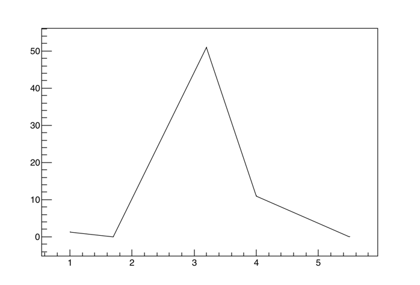

## 3.3 그래프 TGraph

그래프는 우리가 흔히 알고 있듯이 점(x,y)의 배열을 그림으로 그린 것이다.  사용법도 매우 간단하다. 점 추가는 `SetPoint([번호],x,y)` 함수를 사용한다.  `[번호]`는 0부터 시작하며 순서대로 추가할 때는 `GetN()` 함수로 대체하여 사용할 수 있다.

```c++
void example_graph() {
    TGraph* graph = new TGraph();
    graph -> SetPoint(graph->GetN(), 1, 1.2);
    graph -> SetPoint(graph->GetN(), 1.7, -0.1);
    graph -> SetPoint(graph->GetN(), 3.2, 51);
    graph -> SetPoint(graph->GetN(), 4, 11);
    graph -> SetPoint(graph->GetN(), 5.5, 0);
    graph -> Draw("apl");
}
```



`TObject`의 `Draw([옵션])` 함수는 옵션이 매우 다양한데 ([TGraphPainter](https://root.cern.ch/doc/master/classTGraphPainter.html)) 공통적으로 사용하는 옵션 중 `TGraph`에서 알아둘만한 옵션을 적어본다.

- "a" : 그래프 주변에 축을 그림
- "p: " 그래프 마커를 그림
- "l" : 점 사이에 선을 그림
- "same" : 이미 그려진 그림이 있다면 그 위에 같이 그린다. 이 옵션이 없다면 전에 있던 그림은 지워진다.

그래프를 위 코드대로 그리면 축 범위나 이름등을 전혀 설정하지 않는데 이는 `TGraph`의 축 설정이 자동으로 생성되는 히스토그램 클래스 `TH1F`에 의존하기 때문이다.  따라서 축 설정을 할때는 `TGraph`의 `GetHistogram()` 함수로 히스토그램을 가져와서 바꿔주면 된다.

```c++
TH1 *frame = graph -> GetHistogram();
frame -> SetTitle(";x;y");
```

만약에 이 전에 히스토그램을 그렸었다면 `Draw([옵션])` `[옵션]`에서 "a"를 사용하지 않고 "same"을 사용하면 된다.

혹시나 해서 적자면 `TGraph`도 `TNamed`를 상속한다. 다만 이름과 타이틀을 부여하는 생성자가 없을 뿐이다.
