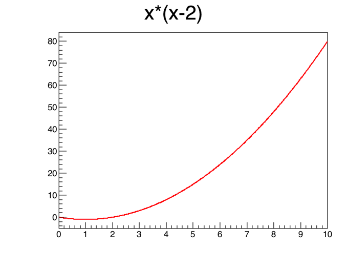
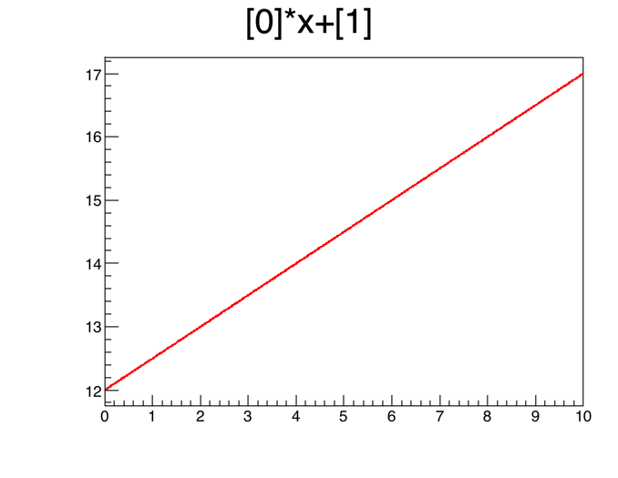

## 3.4 함수 TF1

함수는 TF1 클래스로 구현을 하였다. TF1을 정의하는 방법은 아주 많지만 여기서는 보편적으로 사용하는 몇가지만 알아보자.
더 많은 내용은 [TF1 클래스 레퍼런스](https://root.cern.ch/doc/master/classTF1.html) 에서 볼 수 있다.

### 기본 함수

함수

$$f(x) = x\times (x-2)$$

를 정의하고 0 부터 10 사이의 x 범위에서 그림을 그려보자. 생성자는 다음과 같다.

```c++
TF1("[이름]","[수식]",[범위 처음],[범위 끝])
```

```c++
void example_function() {
    TF1* f = new TF1("example function","x*(x-2)",0,10);
    f -> Draw();
}
```

`[수식]`이 따옴표 안에 들어간다는 점을 기억하자.



앞서 생성자에서 사용한 범위 0 부터 10 은 그림을 그릴 때를 위한 범위일 뿐 함수 자체는 범위에 제한 되지 않는다.
`Eval(x)` 함수를 통하여 지정한 범위 외의 x에서 값을 확인 할 수 있다.

```c++
Double_t y = f -> Eval(22.2);
cout << y << endl;
```
```
448.44
```

### 변수를 포함하는 TF1

이번엔

$$f(x) = a\times x + b$$

와 같은 기울기 a와 y절편 b를 변수로 가지는 직선 함수를 정의해 보자.
사용하는 생성자는 같으나 `[수식]`에 변수 a와 b를 번호를 붙여서 `[0]`과 `[1]`로 표현한다.
그리고 `SetParameter([번호],[값])` 함수를 이용하여 변수의 값을 설정한다.

```c++
void example_function() {
    TF1* f = new TF1("example function","[0]*x+[1]",-5,5);
    f -> SetParameter(0, 0.5);
    f -> SetParameter(1, 12);
    f -> Draw();
}
```




기울기에 해당하는 0번 변수를 0.5로 두고 y절편에 해당하는 1번 변수를 12로 두었으므로 최종 함수의 형태는

$$f(x) = 0.5\times x + 12$$

이며 나타난 그림과 일치하는 것을 볼 수 있다.

변수를 포함하는 `TF1`의 정의는 변수의 값을 바꿔가면서 함수를 재활용 할 수 있다는 이점이 있다.
또 `TF1`의 주 기능 중 하나인 데이터 피팅 사용시에도 이와 같은 정의를 사용한다.
